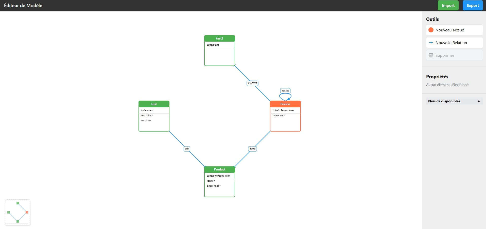

# GUI model creator

_Created mainly using claude AI because I don't like web development._
_It still needs a lot of update_

A simple tool to create graph model, to unify common content.

It allows creation, update, deletion of nodes and relations, with properties.
When the model is finished, it can be exported in json without the structure showed in the [Model save structure](#model-save-structure).
A same file can be imported to be modified.


## Model save structure

```json
{
  "nodes": [
    {
      "name": "Person",
      "labels": ["Person", "User"],
      "properties": [
        {"name": "name", "type": "str", "required": true, "description": "..."}
      ]
    }
  ],
  "relationships": [
    {
      "name": "KNOWS",
      "start_node": "Person",
      "end_node": "Person",
      "properties": [
        {"name": "since", "type": "int", "description": "..."}
      ]
    }
  ]
}
```


## Interface




## TODOs
- [ ] make the node size adapted to the number of properties
- [ ] get rid of the button 'créer' and 'sauvegarder'
- [ ] translate comment and sections names in english
- [ ] When we have two node and two relations, with two types different between those two node, the relation overlap
  - to fix


- [ ] add the multiple selection, with crtl + left click or square selection
  - change the move to the click wheel
- [ ] add a menu on the right click
  - create new node/relation
  - on element, delete element
- [ ] add a button to create a new empty model
  - and tel to the user to export the actual model, before creating a new one
- [ ] merge of models
  - when editing a model, have the possibility to load another model to had his nodes
- [ ] saving of node positions
  - actually, when the nodes are manually positioned, when there is a refresh, they come back to their original positions

- [ ] better graphic design